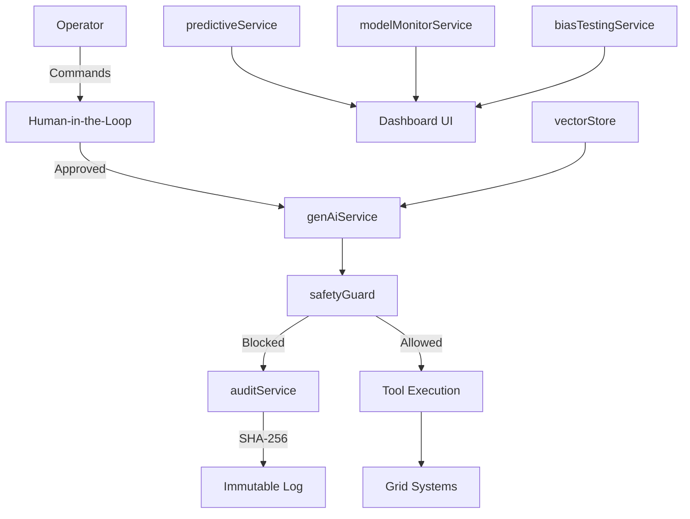

# AI Systems Catalog - GridGuard AI

**NIST AI RMF 1.0 Compliance Document**  
**Last Updated:** 2025-12-17

---

## System Overview

| Component | Type | Risk Level | Human Oversight |
|-----------|------|------------|-----------------|
| GridGuard AI Platform | Decision Support System | Medium-High | Required |

---

## AI Components Registry

### 1. Core AI Services

| ID | Component | Purpose | Model | Risk Level |
|----|-----------|---------|-------|------------|
| AI-001 | `genAiService` | Natural language processing & recommendations | Gemini 1.5 Pro | Medium |
| AI-002 | `liveService` | Voice command processing | Gemini Live API | Medium |
| AI-003 | `agentOrchestrator` | Multi-agent coordination | Custom Logic + Gemini | High |

### 2. Predictive Analytics

| ID | Component | Purpose | Model | Risk Level |
|----|-----------|---------|-------|------------|
| AN-001 | `predictiveService` | N-1 contingency analysis | Statistical + ML | High |
| AN-002 | `cyberSimService` | Attack simulation | Rule-based + AI | Medium |

### 3. Safety & Governance

| ID | Component | Purpose | Model | Risk Level |
|----|-----------|---------|-------|------------|
| GOV-001 | `safetyGuard` | Physics validation | Deterministic | Low |
| GOV-002 | `privacyGuard` | PII protection | Regex + Rules | Low |
| GOV-003 | `auditService` | Immutable logging | SHA-256 Chain | Low |
| GOV-004 | `biasTestingService` | Fairness metrics | Statistical | Low |
| GOV-005 | `modelMonitorService` | Drift & hallucination detection | Rule-based | Low |

### 4. Data Services

| ID | Component | Purpose | Model | Risk Level |
|----|-----------|---------|-------|------------|
| DATA-001 | `vectorStore` | RAG embeddings | Gemini Embedding API | Low |
| DATA-002 | `dataImportService` | CSV ingestion | Deterministic | Low |
| DATA-003 | `fineTuningService` | Training data collection | N/A | Low |

---

## Data Flow Diagram

---

## Risk Assessment Matrix

| Component | Autonomy | Impact | Mitigation |
|-----------|----------|--------|------------|
| genAiService | Low (HITL) | High | Kill switch, safety guard |
| predictiveService | Medium | High | Confidence thresholds |
| agentOrchestrator | Medium | High | Approval workflows |
| cyberSimService | Low | Low | Sandboxed simulation |

---

## Third-Party Dependencies

| Vendor | Service | Data Shared | Risk |
|--------|---------|-------------|------|
| Google | Gemini API | Prompts, context | Medium |
| Google | Embedding API | Document chunks | Low |
| GridStatus.io | Real-time data | API requests | Low |
| EIA.gov | Historical data | None | Low |

---

## Version History

| Version | Date | Changes |
|---------|------|---------|
| 2.0 | 2025-12-17 | Added bias testing, model monitoring |
| 1.0 | 2025-12-01 | Initial catalog |
