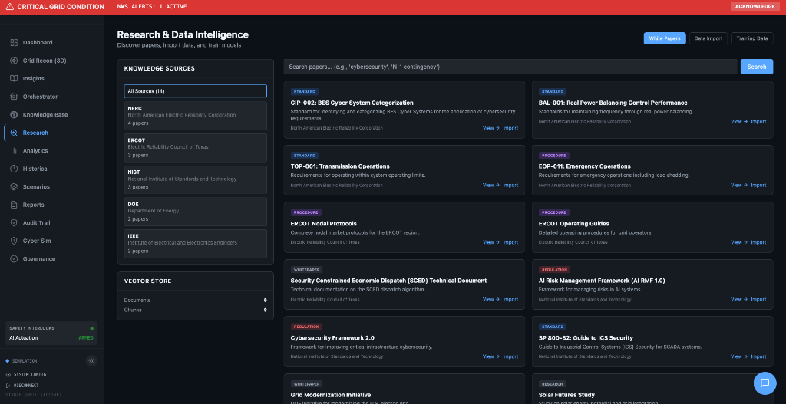

# GridGuard AI


> **Cognitive Grid Defense & Management Platform**  
> AI-powered decision support for critical energy infrastructure operators, designed for government, utility, and enterprise deployment.

---

## Executive Summary

GridGuard AI is an **enterprise-grade command center** for electric grid operators and critical infrastructure stakeholders. The platform combines real-time situational awareness, AI-powered analytics, and comprehensive governance frameworks to support grid reliability, cybersecurity preparedness, and regulatory compliance.

**The Challenge:** Modern power grids face increasing complexity from renewable integration, cyber threats, and extreme weather events. Operators need unified visibility across assets, predictive intelligence, and auditable AI decision support.

**Our Solution:** A physics-informed AI platform that provides:
- Real-time grid visualization and monitoring
- Multi-agent AI orchestration with human-in-the-loop controls
- NIST AI RMF 1.0 compliance framework out-of-the-box
- Cybersecurity training and incident response simulation

---

## Target Audiences

| Sector | Primary Use Cases |
|--------|-------------------|
| **Government (DOE, DHS, CISA)** | Grid security assessment, AI governance compliance, critical infrastructure mapping |
| **Electric Utilities** | Real-time operations, load forecasting, N-1 contingency analysis |
| **Data Center Developers** | Site selection near grid capacity, power availability analysis |
| **Oil & Gas Companies** | Pipeline proximity to transmission corridors, substation accessibility |
| **Defense Contractors** | Critical infrastructure visualization, cybersecurity scenario training |
| **Energy Traders** | Market intelligence, nodal price monitoring, demand forecasting |

---

## Platform Capabilities

> **Important:** GridGuard AI is not a proof-of-concept or toy project. The AI systems are fully implemented with production-grade architecture. All features marked "Operational" below are real, working implementations.

### Architecture Summary

| Component | Lines of Code | Implementation |
|-----------|---------------|----------------|
| Agent Orchestrator | 447 | Full Gemini Pro integration with 5 McKinsey-style agent personas |
| Cyber Simulation | 469 | Complete attack simulation engine with multi-phase scenarios |
| GenAI Service | 353 | Full Gemini Pro integration with multimodal and function calling |
| Safety Guards | 200+ | Physics-based guardrails, kill switches, bias testing |
| Audit System | 150+ | Cryptographic SHA-256 event logging |

### Current Status (v3.0.0)

| Capability | Status | Details |
|------------|--------|---------|
| **3D Digital Twin** | Operational | CesiumJS globe, satellite imagery, 3D assets, power flow visualization |
| **Real-Time Dashboard** | Operational | Grid metrics, thermal mapping, predictive alerts |
| **Multi-Agent Orchestrator** | Operational | 5 AI agents (Weather, Load, Grid, Optimizer, Commander) with real Gemini Pro calls |
| **Cyber Simulation Engine** | Operational | SCADA, DDoS, Ransomware scenarios with decision trees and scoring |
| **AI Governance Framework** | Operational | NIST AI RMF compliance, bias testing, drift detection, audit trail |
| **Research & Knowledge** | Operational | NERC/ERCOT/NIST standards library, vector store, RAG integration |
| **AI Chat Assistant** | Operational | Gemini Pro with function calling, multimodal support |

### Demo Mode vs Production Mode

The platform operates in two modes:

| Mode | Data Source | AI Behavior | Use Case |
|------|-------------|-------------|----------|
| **Demo Mode** | Synthetic grid data | AI calls Gemini OR shows cached responses | Evaluation, demos, training |
| **Production Mode** | Real API feeds (ERCOT, GridStatus.io) | Live Gemini Pro calls | Operational deployment |

**To unlock full AI capabilities:** Add your Gemini API key to `.env.local` as `VITE_GOOGLE_API_KEY`

### Commercial-Ready Vision

With enterprise data integration, GridGuard AI enables:

| Use Case | Required Integration | Value Delivered |
|----------|----------------------|-----------------|
| **Optimal Site Selection** | GIS data, substation capacity feeds | Identify ideal locations for data centers, O&G facilities near grid capacity |
| **Predictive Maintenance** | SCADA historians, sensor feeds | AI-driven failure prediction for substation equipment |
| **Real-Time Trading** | ERCOT API, nodal pricing feeds | Live LMP monitoring and price forecasting |
| **Active Cyber Defense** | SIEM integration, network feeds | Automated threat detection and response |
| **Emissions Optimization** | Carbon intensity APIs | Dispatch optimization for sustainability targets |

---

## Feature Showcase

### Grid Recon — 3D Digital Twin


**Production-Ready Visualization:**
- CesiumJS-powered globe with Bing Maps satellite imagery
- Real-time power flow corridors with animated visualization
- 3D asset markers (wind turbines, solar farms, nuclear plants, substations)
- Interactive camera controls with preset location navigation
- Layer management (Commercial, Military, Agricultural zones)
- Automatic Esri fallback for guaranteed reliability
- Error boundary crash protection

---

### Dashboard — Operations Center


**Real-Time Situational Awareness:**
- Grid frequency, load, and generation metrics
- Fuel mix breakdown (Wind, Solar, Gas, Nuclear, Coal, Hydro)
- Regional thermal mapping with NWS weather integration
- SCED dispatch optimization recommendations
- Congestion monitoring with corridor spread analysis
- Predictive alerts with risk scoring

*Note: Metrics display synthetic data in demo mode. Production deployment requires ERCOT/GridStatus.io API integration.*

---

### Research & Data Intelligence



**Knowledge Management:**
- Curated sources (NERC, ERCOT, NIST, DOE, IEEE standards)
- Research paper discovery and import
- Vector store integration for RAG-powered queries
- Data import workflows for model fine-tuning
- Document upload and processing

---

### AI Governance — NIST AI RMF Alignment


**Enterprise AI Safety:**
- Bias testing and fairness metrics
- Model drift detection and alerting
- Hallucination checks for AI outputs
- Cryptographic audit trail (SHA-256 hashed logs)
- Kill switches and safe mode controls

| NIST AI RMF Function | Implementation Status |
|----------------------|----------------------|
| GOVERN | 90% Complete |
| MAP | 85% Complete |
| MEASURE | 95% Complete |
| MANAGE | 95% Complete |

---

### Cyber Simulation Engine — Operator Training


**Full Simulation Implementation (469 lines):**
- Multi-phase attack scenarios (SCADA, DDoS, Ransomware, Insider Threat, Supply Chain)
- Decision trees with time-limited response windows
- Scoring system with consequence modeling
- Visual effects system for asset status changes
- Integration with audit trail for training records
- Difficulty levels: Training → Intermediate → Advanced → Expert

---

### Multi-Agent Orchestrator — AI Coordination


**Production AI System (447 lines):**
- 5 specialized AI agents with distinct personas:
  - **Weather Analyst (WA):** Climate risk and infrastructure stress
  - **Load Forecaster (LF):** Demand intelligence and behavioral economics
  - **Grid Stabilizer (GS):** N-1 contingency and reliability coordination
  - **Optimizer (OP):** Energy trading and congestion analysis
  - **Commander (CM):** Executive synthesis and decision recommendation
- Real Gemini Pro integration with structured JSON responses
- Chain-of-Thought reasoning with financial impact quantification
- McKinsey-style output format (BLUF → Data → Recommendation → ROI)

---

### Market Intelligence


**Energy News Aggregation:**
- Real-time headlines from Reuters, Bloomberg, industry publications
- Texas grid and ERCOT-focused content filtering
- Article summaries with source attribution

---

## Technology Stack

| Layer | Technology |
|-------|------------|
| Frontend | React 18, TypeScript, Tailwind CSS |
| AI Engine | Google Gemini Pro (multimodal) |
| 3D Visualization | CesiumJS with Cesium Ion |
| Data Services | GridStatus.io, EIA, NewsAPI, VisualCrossing |
| Governance | Custom NIST AI RMF implementation |

---

## Getting Started

### Prerequisites

- Node.js v18+
- Modern browser (Chrome/Edge recommended)
- API keys (optional — demo mode works without)

### Installation

```bash
git clone https://github.com/demarcus-crump/GridGuard-AI.git
cd GridGuard-AI
npm install

# Optional: Add API keys for live data
cp .env.example .env.local
# Edit .env.local with your keys

npm run dev
```

Access the platform at `http://localhost:3000`

### Demo Mode

The platform operates in **Demo Mode** by default with synthetic data. No API keys required for evaluation.

---

## Project Structure

```
gridguard-ai/
├── pages/                    # Application views
│   ├── Dashboard.tsx         # Operations center
│   ├── DigitalTwin.tsx       # 3D Grid Recon
│   ├── Governance.tsx        # AI compliance
│   ├── CyberSim.tsx          # Attack simulation
│   └── Research.tsx          # Knowledge base
├── services/
│   ├── genAiService.ts       # Gemini integration
│   ├── agentOrchestrator.ts  # Multi-agent framework
│   ├── safetyGuard.ts        # Physics guardrails
│   ├── auditService.ts       # Cryptographic logging
│   └── dataServiceFactory.ts # Demo/production routing
├── components/
│   ├── MapErrorBoundary.tsx  # Crash protection
│   └── ...
└── docs/
    ├── ARCHITECTURE.md       # Technical documentation
    └── ROADMAP.md            # Feature roadmap
```

---

## Documentation

| Document | Description |
|----------|-------------|
| [AI_GOVERNANCE_FRAMEWORK.md](AI_GOVERNANCE_FRAMEWORK.md) | NIST AI RMF alignment details |
| [AI_SYSTEMS_CATALOG.md](AI_SYSTEMS_CATALOG.md) | AI component registry |
| [docs/ARCHITECTURE.md](docs/ARCHITECTURE.md) | Technical architecture |
| [SECURITY.md](SECURITY.md) | Security policies |
| [CONTRIBUTING.md](CONTRIBUTING.md) | Contribution guidelines |

---

## Security

- All API credentials loaded via environment variables
- No hardcoded secrets in source code
- `.env.local` excluded from version control
- See [SECURITY.md](SECURITY.md) for vulnerability reporting

---

## Disclaimer

This software is an **enterprise prototype** intended for demonstration and evaluation purposes. It is **not certified for direct control of production critical infrastructure**. Deployment in operational environments requires additional validation, security hardening, and regulatory approval.

---

## Business Inquiries

For enterprise licensing, custom integration, or partnership opportunities:

**DeMarcus Crump**  
[GitHub](https://github.com/demarcus-crump) | [LinkedIn](https://linkedin.com/in/demarcuscrump)

---

## License

MIT License — See [LICENSE](LICENSE) for details.

---

## Acknowledgments

Built with:
- [React](https://react.dev/) + [TypeScript](https://www.typescriptlang.org/)
- [Google Gemini Pro](https://ai.google.dev/)
- [CesiumJS](https://cesium.com/)
- [GridStatus.io](https://www.gridstatus.io/)
