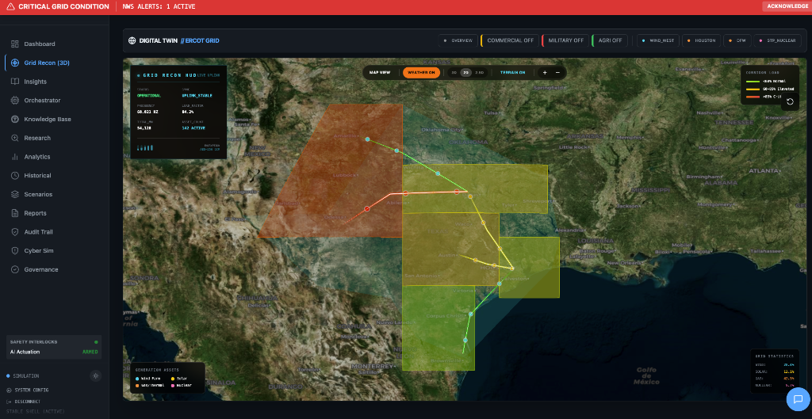
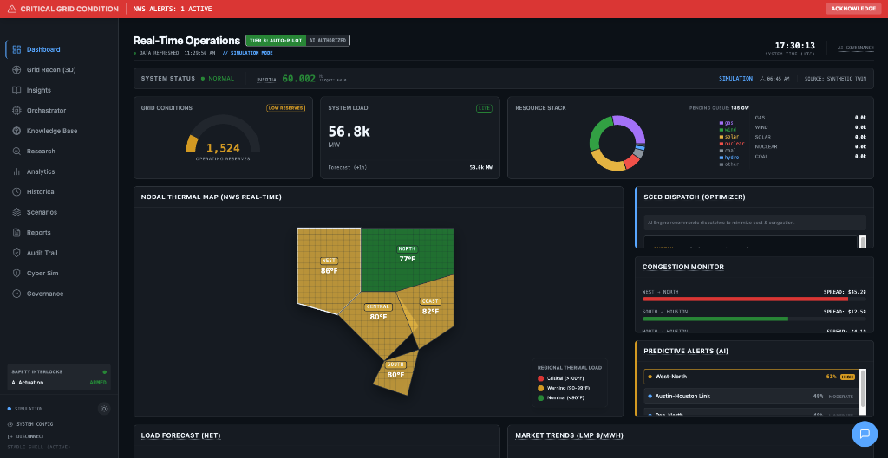
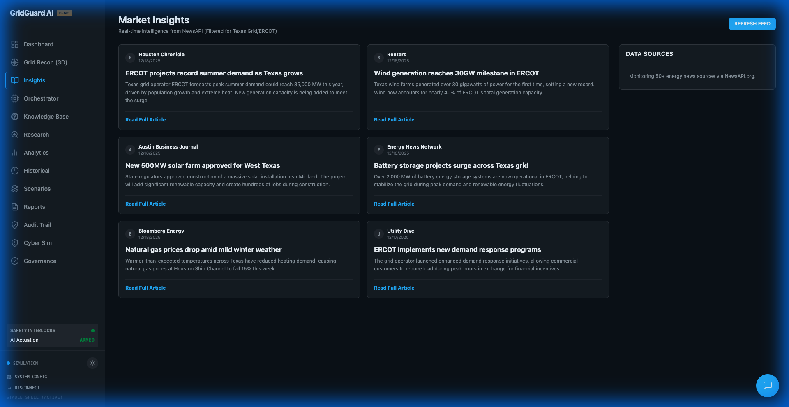
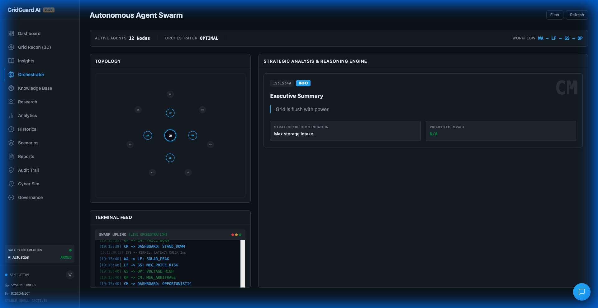
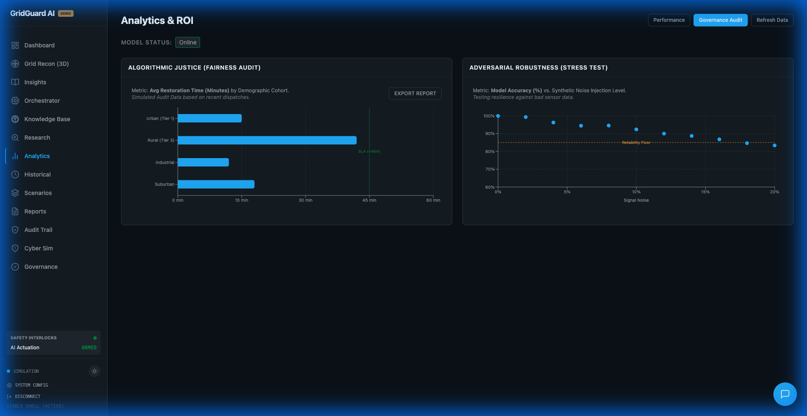
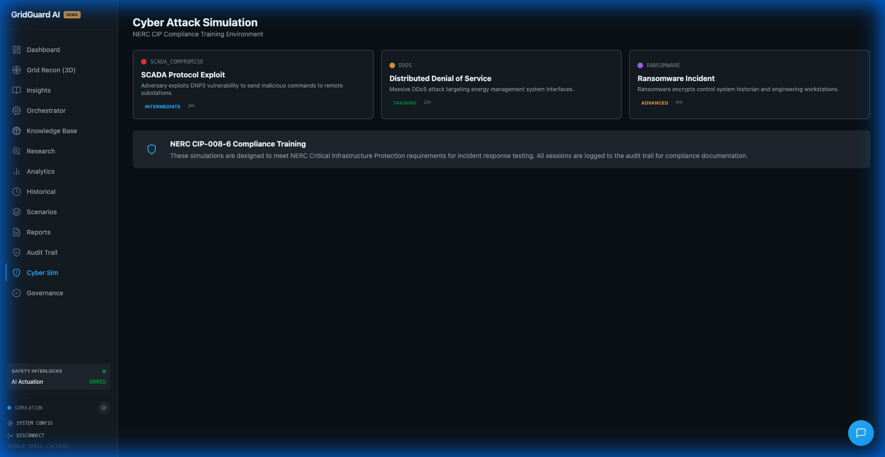

# GridGuard AI


> **Cognitive Grid Defense & Management Platform**  
> A physics-informed, AI-driven Decision Support System (DSS) for critical infrastructure operators. Built with NIST AI RMF 1.0 compliance and NERC CIP governance.

---

## 📸 Feature Showcase

### Grid Recon - 3D Digital Twin
*Commercial-ready 3D visualization of the Texas power grid with real-time satellite imagery*


<!-- Screenshot: 3D globe showing Texas with satellite imagery, power corridors, and asset markers -->

**Key Features:**
- CesiumJS-powered 3D globe with Bing Maps satellite imagery
- Real-time power flow visualization with animated corridors
- 3D asset representation (wind turbines, solar farms, nuclear plants)
- Interactive camera controls (zoom, pan, rotate, fly-to locations)
- Layer toggles (Commercial, Military, Agricultural)
- McKinsey-style asset analysis panel
- Automatic Esri fallback for reliability

---

### Dashboard - Real-Time Grid Metrics
*Live telemetry and predictive analytics at a glance*


<!-- Screenshot: Main dashboard with frequency, load, fuel mix charts -->

**Key Features:**
- Live grid frequency monitoring
- Current load and generation metrics
- Fuel mix breakdown (Wind, Solar, Gas, Nuclear, Coal)
- Predictive alerts and N-1 contingency analysis
- Regional status heatmap

---

### AI Insights - Intelligent Analysis
*Multi-agent AI system providing actionable recommendations*


<!-- Screenshot: Insights page with AI-generated recommendations -->

**Key Features:**
- Gemini Pro-powered analysis
- Multi-agent orchestration with Chain-of-Thought reasoning
- Human-in-the-Loop approval workflow
- Physics-based safety guardrails

---

### Agent Orchestrator - Multi-Agent System
*Visualize AI agent collaboration and decision-making*


<!-- Screenshot: Agent orchestrator showing agent nodes and connections -->

**Key Features:**
- Real-time agent activity monitoring
- Chain-of-Thought visualization
- Agent performance metrics
- Task delegation and coordination

---

### AI Governance - NIST AI RMF Compliance
*Comprehensive AI safety, fairness, and monitoring*


<!-- Screenshot: Governance dashboard with bias metrics and model monitoring -->

**Key Features:**
- Bias testing and fairness metrics
- Model drift detection
- Hallucination checking
- Cryptographic audit trail (SHA-256)
- Kill switches and safe mode

---

### Cyber Simulation - Attack Training
*Realistic cybersecurity scenarios for grid operators*


<!-- Screenshot: Cyber simulation interface showing attack scenario -->

**Key Features:**
- SCADA attack simulations
- DDoS scenario training
- Ransomware response drills
- Incident response playbooks

---

## 🎯 What Is This?

GridGuard AI is an **enterprise-grade command center** for electric grid operators. It combines:

- 🧠 **AI-Powered Insights** - Multi-agent orchestration with Gemini Pro
- 🌍 **3D Digital Twin** - CesiumJS-powered visualization with real-time data
- 🔒 **AI Governance** - Full NIST AI RMF 1.0 compliance
- 🛡️ **Cybersecurity Training** - Attack simulation scenarios
- 📊 **Predictive Analytics** - N-1 contingency analysis

---

## ✨ Core Features

### Real-Time Monitoring
- Live grid frequency, load, and generation metrics
- Fuel mix breakdown (Wind, Solar, Gas, Nuclear, Coal)
- Regional status with weather integration
- Predictive alerts and anomaly detection

### 3D Grid Recon (Commercial-Ready)
- CesiumJS digital twin with satellite imagery
- 3D asset visualization (wind turbines, solar farms, nuclear plants, data centers)
- Animated power flow corridors
- Interactive camera controls and layer toggles
- McKinsey-style asset analysis
- Error boundary crash protection
- Automatic Esri fallback for reliability

### AI Intelligence
- Multi-agent orchestration with Gemini Pro
- Chain-of-Thought reasoning visualization
- Human-in-the-Loop approval workflow
- Physics-based safety guardrails
- Voice and vision capabilities

### AI Governance (NIST AI RMF 1.0)
- Bias testing and fairness metrics
- Model drift detection
- Hallucination checking
- Cryptographic audit trail (SHA-256)
- Kill switches and safe mode

### Cybersecurity Training
- SCADA attack simulations
- DDoS scenario training
- Ransomware response drills
- Incident response playbooks

### Advanced Analytics
- N-1 contingency analysis
- Predictive outage modeling
- Historical playback and incident recording
- What-if scenario simulations
- NERC CIP compliance reporting

---

## 🚀 Getting Started

### Prerequisites

- Node.js (v18+)
- Modern Browser (Chrome/Edge recommended)
- **API Keys** (Optional - Demo Mode works without):
  - [Google AI Studio](https://aistudio.google.com/) (Gemini)
  - [GridStatus.io](https://www.gridstatus.io/api)
  - [Cesium Ion](https://cesium.com/ion/) (3D map)

### Installation

```bash
git clone https://github.com/your-username/gridguard-ai.git
cd gridguard-ai
npm install

# Create .env.local and add your API keys (optional)
cp .env.example .env.local

npm run dev
```

Open `http://localhost:3000` in your browser.

### Demo Mode

The platform works out-of-the-box in **Demo Mode** with synthetic data. No API keys required.

To toggle Demo Mode:
1. Open browser console
2. Run: `localStorage.setItem('DEMO_MODE', 'true')`
3. Refresh the page

---

## 📁 Project Structure

```
gridguard-ai/
├── pages/                 # Route Views
│   ├── Dashboard.tsx      # Main control panel
│   ├── DigitalTwin.tsx    # 3D CesiumJS map
│   ├── Governance.tsx     # AI compliance dashboard
│   ├── CyberSim.tsx       # Attack simulation
│   ├── Research.tsx       # Data intelligence
│   └── AuditLog.tsx       # Immutable event log
├── services/
│   ├── genAiService.ts    # Gemini integration
│   ├── agentOrchestrator.ts # Multi-agent system
│   ├── safetyGuard.ts     # Physics guardrails
│   ├── auditService.ts    # SHA-256 logging
│   ├── biasTestingService.ts # Fairness testing
│   ├── modelMonitorService.ts # Drift detection
│   ├── dataServiceFactory.ts # Demo/Real data routing
│   ├── demoDataService.ts # Synthetic data
│   └── apiService.ts      # Real API calls
├── components/
│   ├── Chat/              # AI assistant
│   ├── Common/            # UI components
│   ├── Layout/            # Navigation
│   └── MapErrorBoundary.tsx # Crash protection
└── docs/
    ├── ARCHITECTURE.md    # Technical architecture
    ├── ROADMAP.md         # Feature roadmap
    └── screenshots/       # Feature screenshots
```

---

## 📊 Navigation

| Route | Page | Description |
|-------|------|-------------|
| `/` | Dashboard | Real-time grid metrics, predictive alerts |
| `/recon` | Grid Recon | 3D digital twin with Cesium |
| `/insights` | Insights | AI analysis & recommendations |
| `/agents` | Orchestrator | Multi-agent visualization |
| `/knowledge` | Knowledge Base | RAG document upload |
| `/research` | Research | White papers & data import |
| `/analytics` | Analytics | Charts & trends |
| `/historical` | Historical | Playback & incident recordings |
| `/scenarios` | Scenarios | What-if simulations |
| `/reports` | Reports | NERC CIP compliance docs |
| `/audit` | Audit Trail | Immutable event log |
| `/cyber-sim` | Cyber Sim | Attack training |
| `/governance` | Governance | AI fairness & monitoring |

---

## 🔐 AI Governance

GridGuard AI is aligned with **NIST AI RMF 1.0**:

| Function | Status |
|----------|--------|
| **GOVERN** | ✅ 90% |
| **MAP** | ✅ 85% |
| **MEASURE** | ✅ 95% |
| **MANAGE** | ✅ 95% |

See [AI_GOVERNANCE_FRAMEWORK.md](AI_GOVERNANCE_FRAMEWORK.md) for details.

---

## 📄 Documentation

| Document | Description |
|----------|-------------|
| [AI_GOVERNANCE_FRAMEWORK.md](AI_GOVERNANCE_FRAMEWORK.md) | NIST AI RMF alignment |
| [AI_SYSTEMS_CATALOG.md](AI_SYSTEMS_CATALOG.md) | AI component registry |
| [docs/ARCHITECTURE.md](docs/ARCHITECTURE.md) | Technical architecture |
| [docs/ROADMAP.md](docs/ROADMAP.md) | Feature roadmap |
| [CONTRIBUTING.md](CONTRIBUTING.md) | Contribution guide |
| [SECURITY.md](SECURITY.md) | Security policy |

---

## 🏗️ Commercial Readiness

### Grid Recon (3D Map) - Production Ready ✅
- ✅ Debug logging removed
- ✅ API token secured in environment variables
- ✅ Error boundary crash protection
- ✅ Automatic Esri fallback for reliability
- ✅ React Strict Mode compatibility
- ✅ Full camera controls (zoom, pan, rotate, fly-to)
- ✅ Layer management (Commercial, Military, Agricultural)
- ✅ 3D asset visualization

### Data Architecture - Clean Separation ✅
- ✅ Factory pattern for Demo/Real mode switching
- ✅ Mock data isolated in `demoDataService.ts`
- ✅ Real API calls in `apiService.ts`
- ✅ Single entry point via `dataServiceFactory.ts`

---

## ⚠️ Disclaimer

This software is a **prototype**. It is intended for demonstration and evaluation purposes. Not certified for control of actual critical infrastructure.

---

## 📄 License

MIT License - See [LICENSE](LICENSE) for details.

---

## 🙏 Acknowledgments

Built with:
- [React](https://react.dev/) + [TypeScript](https://www.typescriptlang.org/)
- [Google Gemini Pro](https://ai.google.dev/)
- [CesiumJS](https://cesium.com/)
- [GridStatus.io](https://www.gridstatus.io/)
- [Tailwind CSS](https://tailwindcss.com/)
