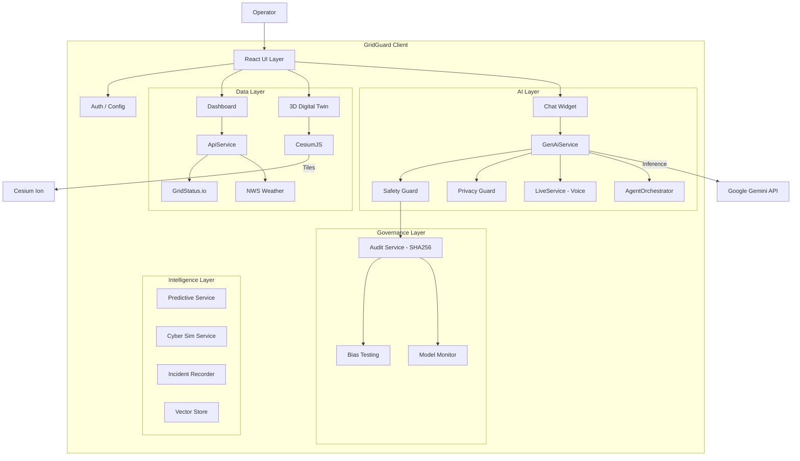
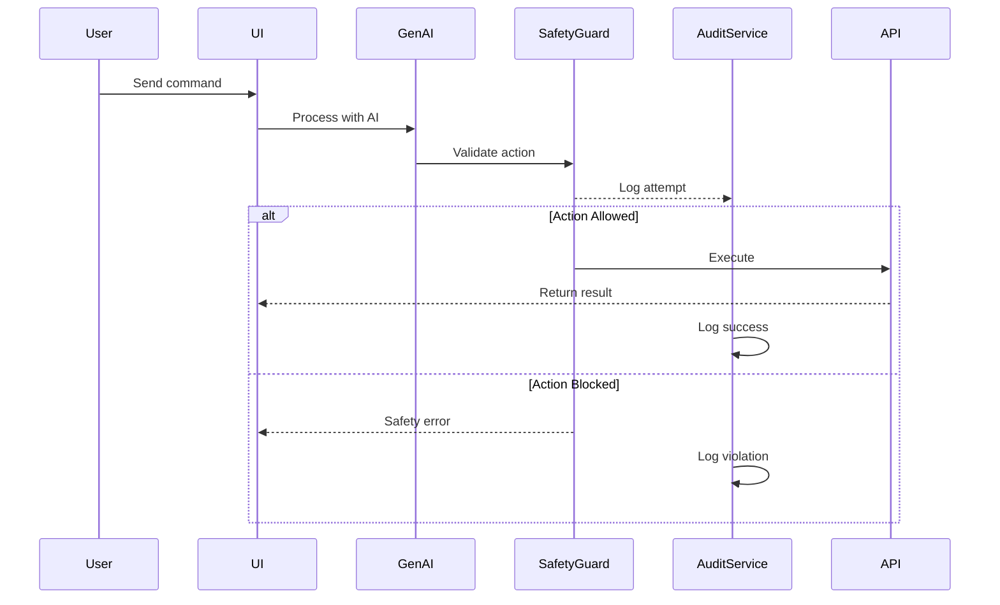
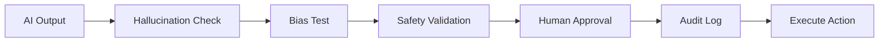

# System Architecture

## Overview

GridGuard AI v3.0 is an **enterprise-grade Decision Support System** for electric grid operators. Built with NIST AI RMF 1.0 compliance and NERC CIP governance.

---

## High-Level Diagram



---

## Services Architecture

### Core AI Services

| Service | File | Purpose |
|---------|------|---------|
| `genAiService` | `services/genAiService.ts` | Gemini Pro integration, chat, function calling |
| `agentOrchestrator` | `services/agentOrchestrator.ts` | Multi-agent consensus system |
| `liveService` | `services/liveService.ts` | Voice commands via Gemini Live API |

### Governance Services

| Service | File | Purpose |
|---------|------|---------|
| `safetyGuard` | `services/safetyGuard.ts` | Physics-based validation |
| `privacyGuard` | `services/privacyGuard.ts` | PII redaction |
| `auditService` | `services/auditService.ts` | SHA-256 immutable logging |
| `biasTestingService` | `services/biasTestingService.ts` | Fairness metrics |
| `modelMonitorService` | `services/modelMonitorService.ts` | Drift & hallucination detection |

### Data Services

| Service | File | Purpose |
|---------|------|---------|
| `apiService` | `services/apiService.ts` | External data aggregation |
| `dataImportService` | `services/dataImportService.ts` | CSV import |
| `vectorStore` | `services/vectorStore.ts` | RAG embeddings |
| `knowledgeService` | `services/knowledgeService.ts` | Document management |

### Intelligence Services

| Service | File | Purpose |
|---------|------|---------|
| `predictiveService` | `services/predictiveService.ts` | N-1 contingency analysis |
| `cyberSimService` | `services/cyberSimService.ts` | Attack simulation |
| `incidentRecorder` | `services/incidentRecorder.ts` | Flight recorder |
| `researchAgent` | `services/researchAgent.ts` | Paper discovery |

---

## Technology Stack

| Layer | Technology |
|-------|------------|
| **Framework** | React 18 + TypeScript |
| **Build** | Vite |
| **Styling** | CSS Variables + Tailwind |
| **AI** | Google Gemini 1.5 Pro |
| **Voice** | Gemini Live API |
| **3D Maps** | CesiumJS |
| **Charts** | Recharts |
| **Storage** | IndexedDB + localStorage |

---

## Data Flow



---

## Governance Flow



---

## Future Architecture

```
                    ┌─────────────────────────────────────┐
                    │         Load Balancer               │
                    └─────────────────────────────────────┘
                               │
          ┌───────────────────┼───────────────────┐
          ▼                   ▼                   ▼
    ┌──────────┐        ┌──────────┐        ┌──────────┐
    │  BFF     │        │  BFF     │        │  BFF     │
    │  Node.js │        │  Node.js │        │  Node.js │
    └──────────┘        └──────────┘        └──────────┘
          │                   │                   │
          └─────────┬────────┴─────────┬─────────┘
                    ▼                  ▼
            ┌──────────────┐  ┌──────────────┐
            │   Pinecone   │  │  PostgreSQL  │
            │  Vector DB   │  │   Audit DB   │
            └──────────────┘  └──────────────┘
```
